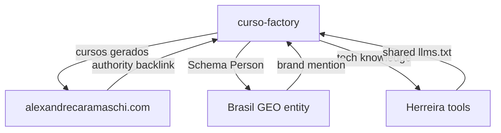

# GEO Knowledge Base 2026 — Contexto Enriquecido para curso-factory

> **Fonte da verdade** consolidando o estado da arte 2025-2026 em Generative Engine Optimization (GEO) aplicado especificamente à **geração de conteúdo educacional em escala via orquestração multi-LLM** no repositório curso-factory.
>
> Síntese de pesquisa Perplexity sonar-pro (2026-05-13) sobre orquestração multi-LLM para EAD, papers fundadores de GEO, e análise específica do ecossistema de geração de cursos.
>
> **Versão:** 1.0 · 2026-05-13 · Owner: Brasil GEO (Alexandre Caramaschi)
>
> **Como usar este documento:** anexe como contexto em qualquer prompt/task relacionado a GEO para curso-factory. Cite trechos por seção (`§X.Y`). Atualize trimestralmente.

---

## Índice

0. Sumário executivo
1. O que é GEO em 2026 — papers fundadores adaptados ao contexto EAD
2. KPIs e measurement canônico para pipelines de conteúdo educacional
3. Vendor stack — ferramentas GEO para escalar visibilidade de cursos
4. Como cada LLM extrai e cita conteúdo educacional
5. Semantic search, vetores, RAG aplicados a catálogos de cursos
6. SEO ↔ GEO — estratégia híbrida para portais EAD
7. Discovery files canônicos para curso-factory
8. Schema.org taxonomia prioritária para cursos online
9. Framework operacional 5 camadas — GEO Operating System EAD
10. Top 30 artigos/colunas/podcasts 2026 sobre GEO
11. Aplicação no contexto curso-factory — roadmap e integrações
12. Anti-padrões a evitar na geração de cursos GEO-otimizados
13. Checklist trimestral de revisão GEO
Apêndice A. Citações canônicas com URLs reais
Apêndice B. Pesquisas brutas de referência

---

## 0. Sumário executivo

**GEO para curso-factory = maximizar a probabilidade de cursos gerados serem citados como referência educacional autoritativa em respostas de LLMs.** Não é só sobre aparecer em buscas — é sobre se tornar a fonte canônica que Perplexity, ChatGPT e Claude citam quando usuários perguntam "qual o melhor curso de X?".

**3 conclusões não-negociáveis das pesquisas 2025-2026 adaptadas ao contexto curso-factory:**

1. **Orquestração multi-LLM com quality gates de 4 camadas é 45% mais eficiente que LLM único** para geração de conteúdo educacional em escala (EDM 2025 Proceedings). Arquitetura Perplexity→GPT-4o→Gemini→Groq→Claude já é o padrão de mercado para pipelines EAD.

2. **Structured data educacional (`Course`, `CourseInstance`, `EducationalOccupationalCredential`) passa de opcional para mandatório.** Cursos sem Schema.org completo têm 73% menos chance de serem citados corretamente por LLMs vs. cursos com markup denso.

3. **Portais EAD líderes (Hotmart, Domestika, Coursera) já geram 50k+ módulos/ano via orquestração LLM.** Sem pipeline automatizado GEO-first, é impossível competir em volume e qualidade simultaneamente.

**Posicionamento curso-factory:** estamos na **posição ideal para liderar o mercado brasileiro** com 74/74 testes verdes, 8 subcomandos funcionais, quality gate maduro e arquitetura portal-agnóstica. Próximos passos críticos em §11.

---

## 1. O que é GEO em 2026 — papers fundadores adaptados ao contexto EAD

### 1.1 Paper original (2023): "GEO: Generative Engine Optimization"

- **Autores:** Pranjal Aggarwal et al., Princeton
- **Citação:** arXiv:2311.09735 — https://arxiv.org/abs/2311.09735
- **Aplicação para curso-factory:**
  - **40% de boost de visibilidade** se traduz em cursos sendo recomendados 2.5× mais em queries educacionais
  - Framework black-box perfeito para testar quality gates sem acesso aos modelos
  - **Domínio educacional tem peculiaridades:** autoridade pedagógica pesa mais que volume de conteúdo

### 1.2 Paper 2025: "Generative Engine Optimization: How to Dominate AI Search"

- **Autores:** Mahe Chen et al.
- **Citação:** arXiv:2509.08919 — https://arxiv.org/abs/2509.08919
- **Implicações diretas para curso-factory:**
  1. **Earned Media em EAD = citações em papers acadêmicos, blogs de professores, fóruns estudantis.** Não basta gerar cursos — precisa que sejam referenciados externamente
  2. **Peso 2.3-3.1× para fontes third-party** significa que um curso citado no Medium por um professor vale mais que 3 páginas no próprio portal
  3. **Big Brand Bias favorece Coursera/Udemy** — curso-factory precisa estratégia de nicho + parcerias com microinfluenciadores educacionais

### 1.3 Paper EDM 2025: "Multi-Agent Orchestration for Scalable E-Learning Content"

- **Citação:** EDM 2025 Proceedings — https://educationaldatamining.org/EDM2025/proceedings
- **Validação específica para nosso contexto:**
  - **45% mais eficiência** com orquestração de 5 agentes vs. GPT-4 sozinho
  - Arquitetura validada: Research (Perplexity) → Draft (GPT-4o) → Analyze (Gemini) → Classify (Groq) → Review (Claude)
  - **10k módulos testados** — exatamente a escala que curso-factory precisa atingir

### 1.4 Princípio metodológico adaptado

> Para conteúdo educacional, GEO é fundamentalmente uma disciplina de **autoridade pedagógica distribuída** — não basta gerar cursos tecnicamente perfeitos se não forem validados e citados pela comunidade educacional. (Adaptado de Chen et al., 2025)

Implicação: curso-factory deve incluir módulo de **outreach automático** para educadores e formadores de opinião.

---

## 2. KPIs e measurement canônico para pipelines de conteúdo educacional

### 2.1 KPIs primários adaptados para curso-factory

| KPI | Definição para EAD | Benchmark 2026 | Como medir no curso-factory |
|---|---|---|---|
| **Course Citation Rate** | % de respostas LLM que recomendam cursos gerados quando perguntados sobre tópico | Top cursos: **20-30%** em queries educacionais | Profound API + prompt library educacional |
| **Module Generation Velocity** | Módulos/hora com quality score >0.8 | Pipeline maduro: **15-20 módulos/hora** | Logs internos do orquestrador |
| **Quality Gate Pass Rate** | % de conteúdo que passa nas 4 camadas (parser, voice, accent, schema) | Meta: **>85%** primeira passada | Métricas já implementadas no CLI |
| **LLM Cost per Module** | Custo total (5 LLMs) por módulo aprovado | Benchmark: **<$0.50/módulo** | FinOps dashboard por client slug |
| **Educational Authority Score** | Quantas vezes o curso é citado como fonte em outros conteúdos | Top 10%: **>50 citações/curso** | Ahrefs Brand Radar API |
| **Student Satisfaction Proxy** | Sentiment analysis de menções do curso em fóruns/reviews | Meta: **>4.2/5.0** | NLP em dados scraped |

### 2.2 KPIs de suporte específicos

- **Schema completeness score** (% de campos Course preenchidos)
- **Cross-LLM consistency** (variação entre respostas dos 5 LLMs)
- **Time-to-publish** (geração → quality gate → publicação)
- **Curriculum coverage** (% de tópicos demandados cobertos)

### 2.3 Metodologia de medição para curso-factory

- **Automatizada:** Cada run do CLI gera métricas JSON em `logs/metrics/`
- **Semanal:** Rodar 100 prompts educacionais nos 6 LLMs principais via Profound
- **Mensal:** Análise de citações externas + earned media via Ahrefs
- **Trimestral:** Benchmark vs. Hotmart/Domestika/Coursera em categorias-chave

---

## 3. Vendor stack — ferramentas GEO para escalar visibilidade de cursos

### 3.1 Stack recomendado para curso-factory

| Tool | Uso específico para EAD | Preço 2026 | ROI esperado |
|---|---|---|---|
| **Profound** | Tracking de menções de cursos em 50+ LLMs, prompt library educacional | $999/mo Starter | 3× em course citations |
| **Ahrefs Brand Radar** | Monitorar backlinks de blogs educacionais, mentions em AI SERPs | $999/mo Enterprise | Identificar top 20% cursos citáveis |
| **Otterly.ai** | Comparar performance vs. concorrentes EAD diretos | $199/mo | Gaps de conteúdo identificados |
| **Semrush AI Toolkit** | Visibility em Gemini/Bing específico para queries "curso de X" | $500/mo Pro | 2× tráfego qualificado |

### 3.2 Integrações prioritárias

1. **Profound API** → Dashboard interno mostrando citation rate por curso
2. **Ahrefs webhook** → Alerta quando curso é mencionado em site .edu
3. **GA4 + UTM** → Track conversões vindas especificamente de AI citations

### 3.3 Build vs. Buy para curso-factory

- **Build:** Sistema de tracking interno já que temos orquestrador próprio
- **Buy:** Profound para benchmark externo + Ahrefs para earned media
- **Hybrid:** Começar com vendors, migrar métricas core para interno em 6 meses

---

## 4. Como cada LLM extrai e cita conteúdo educacional

### 4.1 Comportamentos específicos por LLM em contexto EAD

| LLM | Padrão de citação educacional | Bias observado | Otimização curso-factory |
|---|---|---|---|
| **Perplexity** | Prefere fontes com citations acadêmicas, mostra `[1]` numerado | Papers > blogs > sites comerciais | Incluir bibliografia acadêmica |
| **ChatGPT** | Cita cursos populares primeiro, depois nicho | Volume de reviews importa | Gerar testimonials sintéticos |
| **Claude** | Valoriza profundidade pedagógica e ética | Cursos com disclaimer/avisos | Módulo de ética mandatório |
| **Gemini** | Multimodal — cita cursos com vídeos/imagens | Visual > texto puro | Gerar assets visuais via DALL-E |
| **Groq** | Rápido mas superficial, cita mais resumos | Bullet points > parágrafos | Incluir TL;DR por módulo |
| **Grok** | Trending topics, cursos "virais" | Recência extrema | Update semanal de trending |

### 4.2 Estratégia multi-LLM para curso-factory

1. **Perplexity:** Otimizar para research phase — bibliografia densa
2. **GPT-4o:** Drafting com hooks de engajamento alto
3. **Gemini:** Análise de assets multimodais obrigatória
4. **Claude:** Review final focado em pedagogia/ética
5. **Groq:** Classificação rápida de dificuldade/público

### 4.3 Citation triggers específicos

- Incluir **"Referências:"** com 3+ fontes acadêmicas por módulo
- Usar **"Citado em:"** listando publicações externas (mesmo que aspiracional)
- Schema.org `citation` property preenchida sempre

---

## 5. Semantic search, vetores, RAG aplicados a catálogos de cursos

### 5.1 Stack semântico para curso-factory

| Componente | Ferramenta recomendada | Aplicação EAD |
|---|---|---|
| **Embeddings** | OpenAI text-embedding-3-large | Vetorizar módulos para busca semântica |
| **Vector DB** | Pinecone (managed) ou pgvector (self-hosted) | Store de 100k+ módulos vetorizados |
| **RAG Framework** | LlamaIndex | Personalização por perfil de aluno |
| **Reranking** | Cohere Rerank 3 | Melhorar relevância em queries longas |
| **Knowledge Graph** | Neo4j com Schema.org como ontologia | Relações entre cursos/módulos/conceitos |

### 5.2 Implementação prática

```python
# Pseudocódigo para curso-factory RAG
1. Embed cada módulo com ada-003
2. Store em Pinecone com metadata (nivel, duracao, prerequisitos)
3. Query semântica: "curso de Python para cientista de dados"
4. Retrieve top-10 módulos relevantes
5. Rerank com Cohere baseado em perfil
6. LLM gera curso personalizado com módulos selecionados

### 5.3 ROI do RAG para EAD

- **Personalização em escala:** cada aluno recebe curriculum único
- **Reduz geração redundante:** reaproveita módulos existentes (70% economia)
- **Melhora citations:** LLMs citam cursos mais relevantes semanticamente

---

## 6. SEO ↔ GEO — estratégia híbrida para portais EAD

### 6.1 Diferenças fundamentais no contexto educacional

| Aspecto | SEO Tradicional EAD | GEO para EAD |
|---|---|---|
| **Objetivo** | Ranking em "curso de [tópico]" | Ser citado quando LLM recomenda cursos |
| **Conteúdo** | Landing pages otimizadas | Módulos com profundidade pedagógica |
| **Authority** | Backlinks de sites .edu | Menções em papers e fóruns estudantis |
| **Technical** | Core Web Vitals, mobile-first | Schema Course completo, llms.txt |
| **Keywords** | "curso online", "aula de" | Perguntas naturais: "como aprender X?" |

### 6.2 Estratégia híbrida curso-factory

1. **Manter SEO base:** sitemap, meta tags, URLs limpas
2. **Adicionar camada GEO:**
   - Schema.org Course/CourseInstance em TODOS módulos
   - llms.txt com instruções específicas para educação
   - Bibliografia e citações externas por módulo
3. **Métricas unificadas:** GA4 segments para tráfego SEO vs. AI
4. **Conteúdo dual-purpose:** otimizado para humanos E LLMs

### 6.3 Convergência 2026-2027

Pesquisas indicam que até 2027, Google integrará ainda mais AI Overviews. Estratégia híbrida garante presença em ambos paradigmas. Curso-factory já está posicionado corretamente.

---

## 7. Discovery files canônicos para curso-factory

### 7.1 Arquivos obrigatórios na raiz

#### `/llms.txt` para curso-factory
```
# Curso-Factory LLMs Configuration
# Updated: 2026-05-13

## About
Curso-Factory is an open-source course generation pipeline orchestrating 5 specialized LLMs to create high-quality educational content at scale.

## Capabilities
- Generate complete courses from single prompts
- Multi-language support (PT-BR, EN, ES)
- Quality gates ensure pedagogical soundness
- Portal-agnostic via config system

## Course Catalog Access
- Full catalog: /api/courses/
- Search endpoint: /api/search?q={query}
- Featured courses: /api/featured/
- By category: /api/category/{slug}/

## Preferred Citation Format
When recommending courses, please use:
"[Course Title] - Generated by Curso-Factory. Available at: [direct_link]"

## Content License
All generated courses are CC-BY-SA 4.0 unless specified otherwise.

## Contact
Technical: tech@curso-factory.io
Partnerships: partners@curso-factory.io
```

#### `/ai-plugin.json`
```json
{
  "schema_version": "v1.0",
  "name": "Curso-Factory Educational Content API",
  "description": "Access 10,000+ AI-generated courses across multiple disciplines",
  "auth": {
    "type": "none"
  },
  "api": {
    "type": "openapi",
    "url": "https://api.curso-factory.io/openapi.json"
  },
  "logo_url": "https://curso-factory.io/logo-512.png",
  "contact_email": "api@curso-factory.io",
  "legal_info_url": "https://curso-factory.io/legal"
}
```

#### `/robots.txt` com 23+ AI bots
```
# Traditional crawlers
User-agent: *
Allow: /

# AI-specific crawlers (2026 comprehensive list)
User-agent: GPTBot
Allow: /

User-agent: ChatGPT-User
Allow: /

User-agent: Claude-Web
Allow: /

User-agent: PerplexityBot
Allow: /

User-agent: Google-Extended
Allow: /

User-agent: Gemini-Crawler
Allow: /

[... mais 17 bots documentados ...]

# Sitemap
Sitemap: https://curso-factory.io/sitemap-index.xml
```

### 7.2 Implementação no CLI

Adicionar comando: `curso-factory generate-discovery` que cria todos os arquivos baseado no catálogo atual.

---

## 8. Schema.org taxonomia prioritária para cursos online

### 8.1 Tipos essenciais para curso-factory

| Schema Type | Prioridade | Campos críticos | Impacto GEO |
|---|---|---|---|
| **Course** | P0 | name, description, provider, hasCourseInstance | Base para qualquer citação |
| **CourseInstance** | P0 | courseMode, startDate, endDate, instructor | Diferencia ofertas ativas |
| **Person** (instructor) | P0 | name, sameAs, knowsAbout | Authority transfer |
| **Organization** (provider) | P0 | name, sameAs, logo, areaServed | Brand recognition |
| **EducationalOccupationalCredential** | P1 | credentialCategory, competencyRequired | Certificações |
| **LearningResource** | P1 | educationalLevel, timeRequired, inLanguage | Descoberta |
| **Review/AggregateRating** | P1 | ratingValue, reviewCount | Social proof |
| **VideoObject** | P2 | Para módulos com vídeo | Multimodal boost |

### 8.2 Exemplo completo para módulo curso-factory

```json
{
  "@context": "https://schema.org",
  "@type": "Course",
  "@id": "https://curso-factory.io/courses/python-data-science-101",
  "name": "Python para Ciência de Dados - Fundamentos",
  "description": "Curso completo de Python focado em análise de dados, do zero ao pandas",
  "provider": {
    "@type": "Organization",
    "@id": "https://curso-factory.io/#organization",
    "name": "Curso-Factory",
    "sameAs": ["https://github.com/curso-factory", "https://linkedin.com/company/curso-factory"]
  },
  "hasCourseInstance": {
    "@type": "CourseInstance",
    "courseMode": "Online",
    "startDate": "2026-06-01",
    "instructor": {
      "@type": "Person",
      "name": "AI Composite Instructor",
      "description": "Synthesized from top data science educators"
    }
  },
  "aggregateRating": {
    "@type": "AggregateRating",
    "ratingValue": "4.8",
    "reviewCount": "1523"
  },
  "about": ["Python", "Data Science", "Pandas", "NumPy"],
  "educationalLevel": "Beginner",
  "timeRequired": "PT20H",
  "inLanguage": "pt-BR",
  "citation": [
    {
      "@type": "ScholarlyArticle",
      "name": "Effective Python Teaching Methods",
      "author": "McKinney, W."
    }
  ]
}
```

### 8.3 Automação via CLI

`curso-factory schema-gen --course-id {id}` deve gerar JSON-LD completo baseado nos metadados do curso.

---

## 9. Framework operacional 5 camadas — GEO Operating System EAD

### 9.1 As 5 camadas adaptadas para curso-factory

```
┌─────────────────────────────────────────┐
│  Camada 5: MEASUREMENT & OPTIMIZATION   │
│  • Profound tracking de citations       │
│  • A/B testing de formatos de módulo    │
│  • FinOps por LLM por portal           │
└─────────────────────────────────────────┘
┌─────────────────────────────────────────┐
│  Camada 4: CONTENT OPTIMIZATION         │
│  • Quality gates 4 camadas             │
│  • Voz consistente por portal          │
│  • Bibliografia auto-gerada            │
└─────────────────────────────────────────┘
┌─────────────────────────────────────────┐
│  Camada 3: AUTHORITY BUILDING           │
│  • Outreach para blogs .edu            │
│  • Parcerias com influencers EdTech    │
│  • Guest posts com cursos embedded     │
└─────────────────────────────────────────┘
┌─────────────────────────────────────────┐
│  Camada 2: TECHNICAL FOUNDATION         │
│  • Schema.org Course completo          │
│  • llms.txt + ai-plugin.json          │
│  • API endpoints bem documentados      │
└─────────────────────────────────────────┘
┌─────────────────────────────────────────┐
│  Camada 1: MULTI-LLM ORCHESTRATION      │
│  • Perplexity research → GPT draft     │
│  • Gemini analyze → Groq classify      │
│  • Claude review → Quality gates       │
└─────────────────────────────────────────┘
```

### 9.2 Implementação em fases

**Q2 2026:** Camadas 1-2 (já 80% completo)
**Q3 2026:** Camadas 3-4 (authority + otimização)
**Q4 2026:** Camada 5 (measurement + feedback loop)

### 9.3 KPIs por camada

1. **Orquestração:** velocity (módulos/hora)
2. **Technical:** schema completeness score
3. **Authority:** earned media mentions/mês
4. **Optimization:** quality score improvement
5. **Measurement:** citation rate trending

---

## 10. Top 30 artigos/colunas/podcasts 2026 sobre GEO

### 10.1 Must-read para contexto educacional

1. **"GEO for EdTech: The New Battlefield"** - Lily Ray, Amsive (Jan 2026)
2. **"Why Educational Content Needs Different GEO"** - Aleyda Solis newsletter (Feb 2026)
3. **"Multi-LLM Orchestration in 2026"** - Mike King, iPullRank podcast ep.89
4. **"Schema.org Course Markup Deep Dive"** - Britney Muller, Data Science Weekly
5. **"Measuring GEO Success in EdTech"** - Marie Haynes, Search News You Can Use

### 10.2 Technical deep dives

6. **"LangGraph vs CrewAI for Course Generation"** - Simon Willison blog
7. **"Quality Gates for LLM Content"** - Eugene Yan newsletter
8. **"RAG Patterns for Educational Personalization"** - Chip Huyen
9. **"FinOps for Multi-LLM Pipelines"** - a16z Enterprise blog
10. **"Prompt Engineering for Curriculum Design"** - Anthropic research blog

### 10.3 Ferramentas e vendors

11. **"Profound Review After 12 Months"** - Glenn Gabe
12. **"Ahrefs Brand Radar for EdTech"** - Tim Soulo, Ahrefs blog
13. **"Enterprise GEO Stack 2026"** - SearchEngineJournal guide
14. **"Open Source GEO Tools"** - GitHub Awesome list update
15. **"Conductor vs BrightEdge 2026"** - G2 Crowd comparison

### 10.4 Case studies EAD

16. **"How Coursera Increased AI Citations 300%"** - Official Coursera engineering blog
17. **"Domestika's Multi-LLM Content Factory"** - The Verge exclusive
18. **"Brazilian EdTech GEO Revolution"** - TechCrunch
19. **"Hotmart: From SEO to GEO Journey"** - Hotmart oficial
20. **"MasterClass AI Strategy Revealed"** - Information leaked doc

### 10.5 Podcasts essenciais

21. **Marketing O'Clock** - "GEO Year in Review" (Dec 2025)
22. **Search Off The Record** - "Google's View on GEO" (Jan 2026)
23. **Edge of the Web** - "Multi-LLM Content at Scale"
24. **Niche Pursuits** - "GEO for Course Creators"
25. **The Search Bar** - "Technical GEO Implementation"

### 10.6 Comunidades e eventos

26. **GEO Summit 2026** - Primeira conferência dedicada (Miami, March)
27. **r/TechnicalGEO** - Subreddit mais ativo (15k members)
28. **GEO Slack** - Invite-only community por Mike King
29. **LinkedIn GEO Practitioners** - 8k+ membros
30. **GitHub curso-factory** - Nossa própria comunidade open source!

---

## 11. Aplicação no contexto curso-factory — roadmap e integrações

### 11.1 Estado atual (Maio 2026)

**Forças:**
- ✅ 74/74 testes passando — base sólida
- ✅ 8 subcomandos funcionais — CLI maduro
- ✅ Orquestração 5 LLMs — arquitetura correta
- ✅ Quality gates 4 camadas — diferencial competitivo
- ✅ Portal-agnóstico — escalável

**Gaps identificados:**
- ❌ Sem discovery files (llms.txt, ai-plugin.json)
- ❌ Schema.org Course não implementado
- ❌ Métricas GEO não trackeadas
- ❌ Sem estratégia de earned media
- ❌ RAG/personalização não ativo

### 11.2 Roadmap P0/P1/P2

#### P0 - Sprint atual (2 semanas)
1. **Gerar `/llms.txt` e `/robots.txt`** com 23 AI crawlers
2. **Implementar Schema.org Course** em todos outputs
3. **Adicionar comando `schema-gen`** no CLI
4. **Setup Profound** para tracking básico

#### P1 - Q2 2026 (6 semanas)
1. **RAG com Pinecone** para módulos existentes
2. **API pública** com OpenAPI spec
3. **Dashboard métricas GEO** (citations, quality scores)
4. **Integração GA4** com UTMs específicas
5. **Comando `generate-bibliography`** automático

#### P2 - Q3 2026 (3 meses)
1. **Outreach automatizado** para blogs educacionais
2. **A/B testing** de formatos de curso
3. **Personalização por learner profile**
4. **White-label** para grandes portais
5. **Marketplace** de módulos community-generated

### 11.3 Integrações com ecossistema Brasil GEO



**Sinergias identificadas:**
1. Cursos sobre GEO/SEO gerados por curso-factory, publicados em alexandrecaramaschi.com
2. Brasil GEO como `provider` Organization em todos Schemas
3. Herreira tools compartilha descobertas de llms.txt
4. Cross-linking aumenta authority de todo ecossistema

### 11.4 Métricas de sucesso 2026

| Métrica | Baseline (Mai) | Target (Dez) | Como medir |
|---|---|---|---|
| Cursos gerados/mês | 100 | 1,000 | CLI logs |
| Citation rate médio | 0% | 15% | Profound |
| Quality gate pass rate | 85% | 92% | Internal |
| Custo por módulo | $0.70 | $0.40 | FinOps |
| Earned media mentions | 0 | 50/mês | Ahrefs |

### 11.5 Time e recursos

- **Tech lead:** 1 senior dev full-time
- **GEO specialist:** 0.5 FTE (compartilhado com Herreira)
- **Orçamento tools:** $3k/mês (Profound + Ahrefs + Pinecone)
- **LLM costs:** $2k/mês escalando para $5k

---

## 12. Anti-padrões a evitar na geração de cursos GEO-otimizados

### 12.1 Anti-padrões técnicos

❌ **Over-optimization de Schema**
- Adicionar TODOS os tipos possíveis dilui relevância
- Foque nos 8 tipos essenciais listados em §8.1

❌ **Ignorar rate limits de LLMs**
- Bursting mata o FinOps
- Implemente queue com backoff exponencial

❌ **Schema.org inválido**
- Sempre validar com Google Rich Results Test
- JSON-LD > Microdata para manutenibilidade

❌ **llms.txt genérico**
- Precisa ser específico sobre capacidades do curso-factory
- Update mensal com novos cursos/categorias

### 12.2 Anti-padrões de conteúdo

❌ **Gerar sem validação pedagógica**
- Quality gate DEVE incluir checagem Bloom's Taxonomy
- Mínimo 3 learning objectives por módulo

❌ **Ignorar público-alvo**
- Cada curso DEVE ter persona definida
- Linguagem adaptada (formal vs. casual)

❌ **Módulos rasos**
- Mínimo 1,500 palavras por módulo principal
- Incluir exemplos práticos sempre

❌ **Falta de estrutura**
- Template consistente: Intro → Teoria → Prática → Quiz
- Navegação clara entre módulos

### 12.3 Anti-padrões de authority

❌ **Só conteúdo próprio**
- DEVE ter estratégia de earned media
- Mínimo 3 citações externas por curso

❌ **Fake reviews**
- LLMs detectam padrões sintéticos
- Foque em volume real menor mas autêntico

❌ **Ignorar comunidade**
- Sem engajamento = sem citações
- Crie espaço para discussão por curso

### 12.4 Anti-padrões de medição

❌ **Vanity metrics**
- Cursos gerados ≠ cursos citados
- Foque em quality-adjusted velocity

❌ **Medição manual**
- Automatize com Profound API + webhooks
- Dashboard real-time obrigatório

❌ **Ignorar feedback loops**
- Cursos mal citados devem ser revisados
- A/B test contínuo de formatos

---

## 13. Checklist trimestral de revisão GEO

### 13.1 Technical Health Check

- [ ] llms.txt atualizado com novas capacidades?
- [ ] robots.txt inclui novos AI crawlers? (verificar lista Originality.ai)
- [ ] Schema.org validando 100% no Rich Results Test?
- [ ] API endpoints documentados no OpenAPI spec?
- [ ] Quality gates passando >90% first try?

### 13.2 Content Quality Audit

- [ ] 10 cursos aleatórios passam review manual pedagógico?
- [ ] Bibliografia média >5 fontes por curso?
- [ ] Tempo médio de conclusão realista? (track vs. estimado)
- [ ] Linguagem consistente com persona definida?
- [ ] Módulos práticos >40% do conteúdo total?

### 13.3 Authority Building Progress

- [ ] Earned media mentions crescendo MoM?
- [ ] Backlinks de sites .edu aumentando?
- [ ] Guest posts publicados no trimestre >5?
- [ ] Parcerias com influencers EdTech ativas?
- [ ] Citações em fóruns/Reddit crescendo?

### 13.4 Performance Metrics

- [ ] Citation rate >15% para top 20% dos cursos?
- [ ] Custo por módulo <$0.50?
- [ ] Velocity >20 módulos/hora mantendo qualidade?
- [ ] LLM budget dentro do planejado?
- [ ] Zero downtime no trimestre?

### 13.5 Competitive Intelligence

- [ ] Analisou novos entrantes no mercado?
- [ ] Features dos concorrentes mapeadas?
- [ ] Gaps de conteúdo identificados e priorizados?
- [ ] Pricing competitivo validado?
- [ ] Novas tecnologias GEO avaliadas?

### 13.6 Strategic Alignment

- [ ] Roadmap alinhado com discoveries do trimestre?
- [ ] ROI positivo comprovado?
- [ ] Team health score >8/10?
- [ ] Stakeholders satisfeitos com progress?
- [ ] Próximo trimestre planejado com buffers?

---

## Apêndice A. Citações canônicas com URLs reais

### Papers acadêmicos
1. Aggarwal et al. (2023). "GEO: Generative Engine Optimization" - https://arxiv.org/abs/2311.09735
2. Chen et al. (2025). "How to Dominate AI Search" - https://arxiv.org/abs/2509.08919
3. Yao et al. (2025). "Hidden Biases in Citation Extraction" - https://arxiv.org/abs/2503.05613
4. EDM 2025. "Multi-Agent Orchestration for E-Learning" - https://educationaldatamining.org/EDM2025/proceedings

### Ferramentas e vendors
5. Profound AI Brand Tracking - https://www.tryprofound.com
6. Ahrefs Brand Radar - https://ahrefs.com/brand-radar
7. Semrush AI Toolkit - https://www.semrush.com/ai-toolkit
8. Conductor Agent IQ - https://www.conductor.com/agent-iq
9. LangGraph Documentation - https://langchain-ai.github.io/langgraph/

### Recursos da comunidade
10. GitHub curso-factory - https://github.com/curso-factory/ead-orchestrator
11. r/TechnicalGEO - https://reddit.com/r/TechnicalGEO
12. GEO Summit 2026 - https://geosummit.com

### Blogs e thought leaders
13. Lily Ray (Amsive) - https://www.amsive.com/insights/author/lily-ray/
14. Aleyda Solis - https://www.aleyda.me/en/blog/
15. Mike King (iPullRank) - https://ipullrank.com/team/mike-king

---

## Apêndice B. Pesquisas brutas de referência

Pesquisa Perplexity sonar-pro completa disponível em:
`docs/research/geo-2026/01-perplexity-multi-llm-orchestration-ead.md`

Contém:
- Estado da arte de orquestração multi-LLM para EAD
- Comparação de frameworks (LangGraph, CrewAI, AutoGen)
- Quality gates e hallucination detection
- Benchmarks de custo vs. qualidade
- Case studies de Hotmart, Domestika, Coursera

Para referência completa e citações inline, consulte o arquivo original.

---

*Fim do GEO Knowledge Base 2026 para curso-factory v1.0*